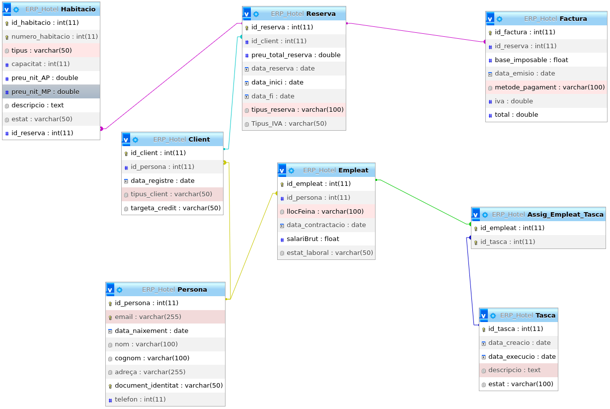

# Pràctica Base de dades
---

## Disseny Conceptual


---

## Disseny Lògic-Relacional

### Taules Principals

- **PERSONA** (`id_persona`, email, data_naixement, nom, cognom, adreça, document_identitat, telefon)
- **CLIENT** (`id_client`, data_registre, tipus_client, targeta_credit, `id_persona`)
  - `id_persona` és clau forana que fa referència a la taula PERSONA (`id_persona`)
- **RESERVA** (`id_reserva`, preu_total_reserva, data_reserva, data_inici, data_fi, tipus_reserva, Tipus_IVA, `id_factura`, `id_habitacio`, `id_client`)
  - `id_factura` és clau forana que fa referència a la taula FACTURA (`id_factura`)
  - `id_habitacio` és clau forana que fa referència a la taula HABITACIÓ (`id_habitacio`)
  - `id_client` és clau forana que fa referència a la taula CLIENT (`id_client`)
- **HABITACIÓ** (`id_habitacio`, numero_habitacio, tipus, capacitat, preu_nit_AD, preu_nit_MP, descripcio, estat)
- **EMPLEAT** (`id_empleat`, llocFeina, data_contractació, salariBrut, estat, `id_persona`)
  - `id_persona` és clau forana que fa referència a la taula PERSONA (`id_persona`)
- **FACTURA** (`id_factura`, data_emisio, metode_pagament, base_imposable, iva, total)
- **TASCA** (`id_tasca`, data_creacio, data_ejecucio, descripcio, estat, `id_empleat`)
  - `id_empleat` és clau forana que fa referència a la taula EMPLEAT (`id_empleat`)
- **ASSIG_EMPLEAT_TASCA** (`id_empleat`, `id_tasca`, estat)
  - `id_empleat` és clau forana que fa referència a la taula EMPLEAT (`id_empleat`)
  - `id_tasca` és clau forana que fa referència a la taula TASCA (`id_tasca`)

---

## UML


---

## Sentències SQL: LDD

```sql
-- Creació de totes les taules
CREATE TABLE Persona (
    id_persona INT PRIMARY KEY AUTO_INCREMENT,
    email VARCHAR(255) UNIQUE NOT NULL,
    data_naixement DATE,
    nom VARCHAR(100),
    cognom VARCHAR(100),
    adreça VARCHAR(255),
    document_identitat VARCHAR(50) UNIQUE NOT NULL,
    telefon INT
);

CREATE TABLE Empleat (
    id_empleat INT PRIMARY KEY,
    llocFeina VARCHAR(100),
    data_contractacio DATE,
    salariBrut FLOAT,
    estat_laboral VARCHAR(50),
    FOREIGN KEY (id_empleat) REFERENCES Persona(id_persona)
);

CREATE TABLE Client (
    id_client INT PRIMARY KEY,
    data_registre DATE,
    tipus_client VARCHAR(50),
    targeta_credit VARCHAR(50),
    FOREIGN KEY (id_client) REFERENCES Persona(id_persona)
);

CREATE TABLE Habitacio (
    id_habitacio INT PRIMARY KEY AUTO_INCREMENT,
    numero_habitacio INT UNIQUE NOT NULL,
    tipus VARCHAR(50),
    capacitat INT,
    preu_nit_AP DOUBLE,
    preu_nit_MP DOUBLE,
    descripcio TEXT,
    estat VARCHAR(50)
);

CREATE TABLE Reserva (
    id_reserva INT PRIMARY KEY AUTO_INCREMENT,
    id_client INT,
    preu_total_reserva DOUBLE,
    data_reserva DATE,
    data_inici DATE,
    data_fi DATE,
    tipus_reserva VARCHAR(100),
    Tipus_IVA VARCHAR(50),
    FOREIGN KEY (id_client) REFERENCES Client(id_client)
);

CREATE TABLE Factura (
    id_factura INT PRIMARY KEY AUTO_INCREMENT,
    id_reserva INT,
    base_imposable FLOAT,
    data_emisio DATE,
    metode_pagament VARCHAR(100),
    iva DOUBLE,
    total DOUBLE,
    FOREIGN KEY (id_reserva) REFERENCES Reserva(id_reserva)
);

CREATE TABLE Tasca (
    id_tasca INT PRIMARY KEY AUTO_INCREMENT,
    data_creacio DATE,
    data_execucio DATE,
    descripcio TEXT,
    estat VARCHAR(100)
);

CREATE TABLE Assig_Empleat_Tasca (
    id_empleat INT,
    id_tasca INT,
    PRIMARY KEY (id_empleat, id_tasca),
    FOREIGN KEY (id_empleat) REFERENCES Empleat(id_empleat),
    FOREIGN KEY (id_tasca) REFERENCES Tasca(id_tasca)
);

-- Inserts de proba
INSERT INTO Persona (email, data_naixement, nom, cognom, adreça, document_identitat, telefon) 
VALUES 
('johndoe@example.com', '1985-06-15', 'John', 'Doe', 'Carrer Falsa 123', '12345678X', 666777888),
('janesmith@example.com', '1990-09-20', 'Jane', 'Smith', 'Avinguda Central 45', '87654321Y', 654321987),
('michaelbrown@example.com', '1982-12-05', 'Michael', 'Brown', 'Plaça Major 78', '11223344Z', 612345678);

INSERT INTO Client VALUES 
(1, '2024-01-01', 'Regular', '1234-5678-9012-3456'),
(2, '2023-05-10', 'VIP', '9876-5432-1098-7654'),
(3, '2022-11-25', 'Ocacional', '5678-9012-3456-7890');

INSERT INTO Habitacio (numero_habitacio, tipus, capacitat, preu_nit_AP, preu_nit_MP, descripcio, estat) 
VALUES 
(101, 'Doble', 2, 50.00, 70.00, 'Habitació doble amb vistes', 'Disponible'),
(102, 'Suite', 4, 120.00, 150.00, 'Suite de luxe amb jacuzzi', 'Ocupada'),
(103, 'Simple', 1, 30.00, 50.00, 'Habitació individual econòmica', 'En neteja');

INSERT INTO Empleat VALUES 
(1, 'Recepcionista', '2020-06-10', 25000, 'Actiu'),
(2, 'Cambrer', '2021-09-15', 20000, 'Baixa'),
(3, 'Neteja', '2019-04-22', 18000, 'Actiu');

INSERT INTO Reserva (id_client, preu_total_reserva, data_reserva, data_inici, data_fi, tipus_reserva, Tipus_IVA) 
VALUES 
(1, 140.00, '2024-02-01', '2024-02-05', '2024-02-07', 'Vacances', '10%'),
(2, 300.00, '2024-02-02', '2024-02-10', '2024-02-15', 'Negocis', '21%'),
(3, 90.00, '2024-02-03', '2024-02-12', '2024-02-14', 'Oci', '7%');

INSERT INTO Factura (id_reserva, base_imposable, data_emisio, metode_pagament, iva, total) 
VALUES 
(1, 120.00, '2024-02-07', 'Tarjeta', 20.00, 140.00),
(2, 250.00, '2024-02-15', 'Efectiu', 50.00, 300.00),
(3, 75.00, '2024-02-14', 'Tarjeta', 15.00, 90.00);

INSERT INTO Tasca (data_creacio, data_execucio, descripcio, estat) 
VALUES 
('2024-02-01', '2024-02-02', 'Neteja habitació 101', 'Pendent'),
('2024-02-03', '2024-02-04', 'Reparació aire condicionat', 'En procés'),
('2024-02-05', '2024-02-06', 'Inventari cuina', 'Completada');

INSERT INTO Assig_Empleat_Tasca (id_empleat, id_tasca) 
VALUES 
(1, 1),
(2, 2),
(3, 3);

-- Vaig fer aquesta modificació ja que s'em va oblidar ficar la clau forana
-- de la taula Habitació per poder-la relacionar amb la taula Reserva.
ALTER TABLE Habitacio
ADD COLUMN id_reserva INT,
ADD CONSTRAINT habitacio_reserva
FOREIGN KEY (id_reserva) REFERENCES Reserva(id_reserva);
```

---

## Estructura



---

## Errors

### Error al cambiar d'escena


Em donaba un error de que no trobaba la ruta del fitxer fxml que buscaba. Això era perquè el fitxer que intentaba buscar tenia el nom en castellà, mentre que el nom del fitxer el estaba en català.

### Error en crear i guardar una nova reserva en la base de dades

Vaig tindre un problema al crear una nova  reserva el qual consisteix en que quan l’he creat, em surt el missatge que vaig programar per quan em creï una reserva de forma exitosa. Però encara això quan vaig a checkejar que s’hagi creat exitosament en la base de dades, no apareix la nova reserva creada.

### Error de valor null en el camp id_reserva de la Taula Factures


Aquest error va passar perquè se’m va oblidar ficar-li el id_reserva al objecte Factura quan el creava.


Ho vaig solucionar modificant la consulta per a que també em consultés el id_reserva (per solucionar el error de manera ràpida i per a que no em donès error al crear un objecte, en comptes de modificar el construcor i afegir-li aquest camp, simplement vaig crear la variable del camp i li vaig fer un getter i setter).


Desprès vaig crear un nou construcor per poder crear la factura amb el nou camp i posteriorment visualitzar-lo.


Per poder visualitzar el nou camp afegir, simplement he de afegir el nou camp en el controlador també.


---

## Manual d'us

a
[](https://youtu.be/0UjjLZcOEPA)


---
